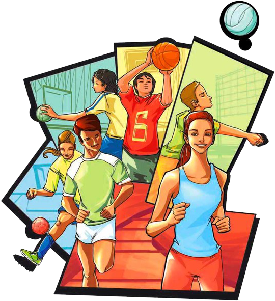

<!DOCTYPE html>
<html lang="es">
<head>
    <meta charset="UTF-8">
    <title>Portafolio Web</title>
    
</head>
<body>
    

        

            
        

        

            
            <h1>Hola! Mi nombre es Micaela Gómez y tengo 26 años. 😁</h1>
            

                Soy profesora de Educación Física con orientación en Deporte. Actualmente dicto clases en primaria. 

                

Durante la realización de la tesina en la universidad, tuve un primer acercamiento al lenguaje Python, lo que despertó en mí un gran interés por el mundo de la programación, motivándome a comenzar a formarme en esta área.
            

        

        

            
        

    

</body>
</html>
